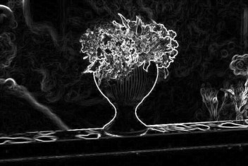
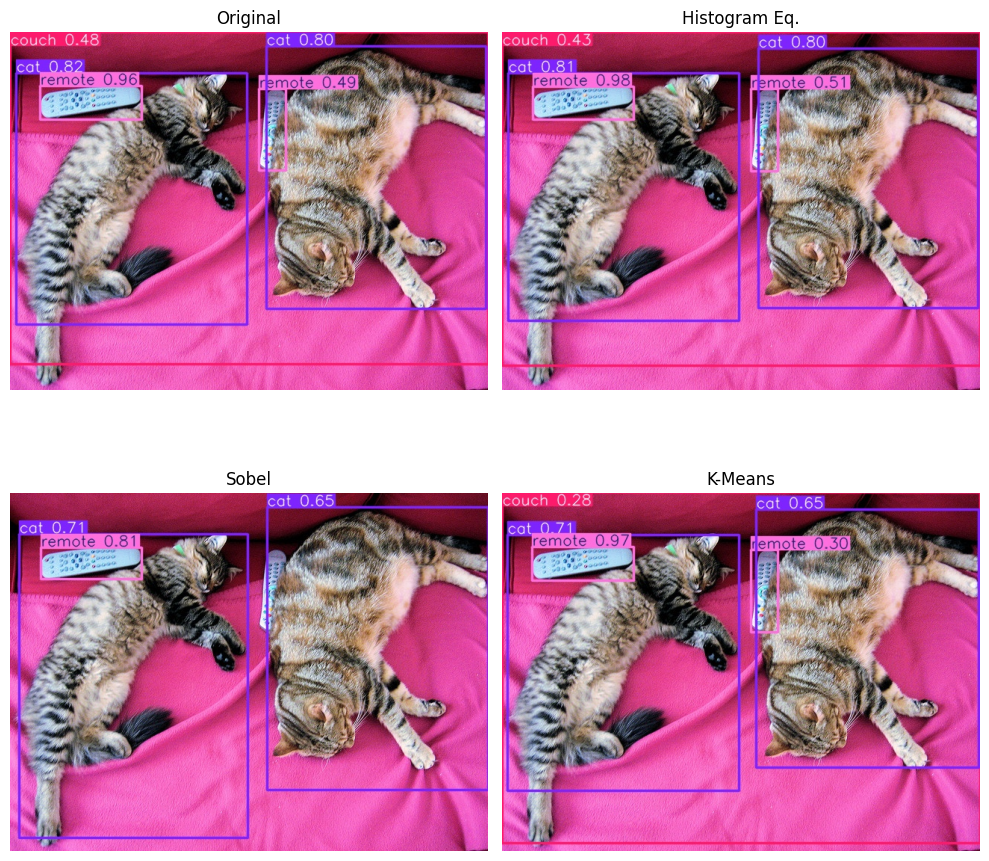

# Object Detection using YOLOv8 on COCO128
This project investigates the effect of different image preprocessing techniques on object detection performance using the YOLOv8 model. The study involves applying preprocessing methods to training data, retraining the model for each case, and evaluating detection accuracy using standard performance metrics and visual comparisons.

## 📌 Objective
To analyze how preprocessing techniques can enhance or hinder the detection accuracy of an object detection model. This was achieved by:

- Applying selected preprocessing techniques to the dataset.

- Training YOLOv8 models separately on each variation.

- Comparing detection results and performance metrics.

- Visualizing the before/after effects and detection outputs.

## 🧪 Preprocessing Techniques Used
Three preprocessing techniques were selected based on their relevance to the course and potential impact on feature enhancement:

**1. Histogram Equalization**

- Enhances global contrast of images by redistributing pixel intensity values.

- Improves object visibility under varying lighting conditions.

**2. Sobel Edge Detection**

- Highlights object edges by detecting intensity gradients.

- Emphasizes boundaries and structural features useful for object localization.

**3. K-means Segmentation**

- Reduces color complexity and segments regions by clustering pixel colors.

- Useful for separating foreground objects from noisy backgrounds.

- Each technique was applied directly to the training dataset, with YOLOv8 retrained per variant.

## 🖼️ Visual Results

  ### Preprocessing Effects

Sample "before and after" images are displayed to show the effect of preprocessing.

| Original Image | Histogram Equalization | Sobel Edge Detection | K-Means Segmentation |
|----------------|------------------------|-----------------------|-----------------------|
|  |  |  |  |

### Detection Outputs

Below is a sample visualization of YOLOv8 predictions after training with different preprocessing techniques:




## 📈 Evaluation Metrics
Metrics used for comparison:

- mAP@0.5
- mAP@0.5:0.95
- Precision
- Recall

| Preprocessing Technique    | mAP@0.5 | mAP@0.5:0.95 | Precision | Recall  |
|----------------------------|---------|--------------|-----------|---------|
| **Unprocessed (Original)** | 0.64228 | 0.46769      |  0.63846  | 0.56557 |
| **Histogram Equalization** | 0.60002 | 0.43779      | 0.57998   | 0.55656 |
| **Sobel Edge Detection**   | 0.29510 | 0.19888      | 0.64009   | 0.24080 |
| **K-Means Segmentation**   | 0.36865 | 0.24216      | 0.54966   | 0.35670 |

The results indicate that histogram equalization led to the best overall detection performance, while edge detection and segmentation introduced potential trade-offs in recall or localization accuracy.

## 🛠️ How to Run

1. Clone the repository:
   ```bash
   git clone https://github.com/zeinahezzah/Object-detection-using-YOLOv8-on-COCO128-
   
2. Open the notebook in Google Colab and follow the instructions to:
   - Load COCO128
   - Apply preprocessing
   - Train models using YOLOv8
   - Visualize and evaluate outputs

## 📂 Dataset
The dataset used is the COCO128 subset, a lightweight version of MS COCO suitable for testing and prototyping.

## 📌 Future Work
- Apply additional preprocessing techniques like CLAHE or bilateral filtering.
- Test on larger datasets (e.g., full COCO or Pascal VOC).
- Experiment with real-time object detection with preprocessed video inputs.

